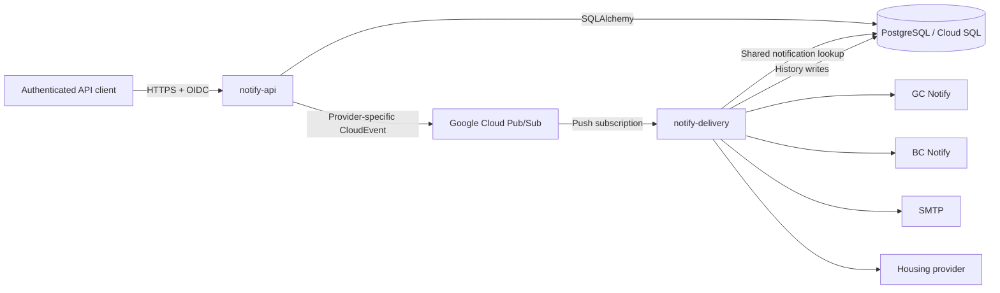
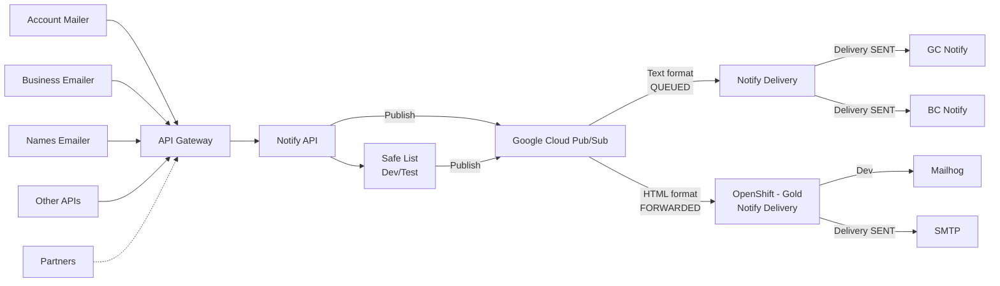

# Architecture Overview

This document follows the [architecture.md](https://architecture.md/) structure and is the canonical architectural orientation for the BC Registries Notify Service. Keep it current when service boundaries, data contracts, deployment, integrations, or operational assumptions change.

For detailed behavior, see:

- [Notify API contract](notify-api/src/notify_api/static/openapi.yaml)

## 1. Project Structure

```text
notify-service/
├── notify-api/                         # Authenticated notification API
│   ├── src/notify_api/
│   │   ├── resources/                  # Flask API blueprints and endpoints
│   │   ├── services/                   # Provider selection and Pub/Sub publishing
│   │   ├── models/                     # SQLAlchemy/Pydantic shared data model
│   │   ├── config.py                   # Environment-backed application config
│   │   └── static/openapi.yaml         # OpenAPI API contract
│   ├── migrations/                     # Alembic database migrations
│   ├── tests/                          # API unit tests
│   ├── devops/                         # Cloud deployment and Kubernetes assets
│   ├── Dockerfile                      # Runtime and migration image stages
│   └── pyproject.toml                  # Dependencies and tooling
├── notify-delivery/                    # Pub/Sub push delivery worker
│   ├── src/notify_delivery/
│   │   ├── resources/                  # Provider-specific push endpoints
│   │   ├── services/providers/          # External provider adapters
│   │   ├── services/gcp_queue/          # Pub/Sub integration
│   │   └── config.py                   # Environment-backed worker config
│   ├── tests/                          # Delivery unit tests
│   ├── devops/                         # Cloud deployment assets
│   ├── Dockerfile                      # Distroless runtime image
│   └── pyproject.toml                  # Dependencies and tooling
├── docker-compose.yml                  # Local PostgreSQL container
├── run_local.sh                        # Local API and delivery startup script
└── create_pubsub_bc_notify.sh           # Local/project Pub/Sub setup helper
```

The two packages are independently deployable but are coupled through the shared PostgreSQL schema, notification model, provider enum, notification statuses, and CloudEvent contract.

## 2. High-Level System Diagram



The API is the ingress and orchestration boundary. The delivery service is the asynchronous execution boundary. Pub/Sub carries a CloudEvent containing the notification identifier; the delivery service retrieves the full notification from the shared database.

### Business and deployment context

The following view incorporates the supplied service diagram. It documents the known ecosystem around the two applications, including upstream mailers, partners, the API Gateway, Google Cloud, the OpenShift-Gold forwarding path, and provider lifecycle context.



The diagram is an environment and business-context view, not a replacement for the route and event contracts in this repository. In particular, `API Gateway`, the OpenShift forwarding flow, provider subscription names, and the GC Notify decommission date are deployment-owned facts and should be verified against current platform configuration before operational changes. The supplied diagram records GC Notify decommission as planned for **2026-12-30**. `Mailhog` is a development destination, not a production provider.

## 3. Core Components

### 3.1 notify-api

**Purpose:** Accept authenticated email notification requests, validate them, persist notification work, choose a provider, and publish delivery events.

**Technology:** Python 3.12+, Flask, Flask-Pydantic, Pydantic, Flask-SQLAlchemy, PostgreSQL, Google Cloud Pub/Sub, HTTPX, OIDC/JWT.

**Application factory:** `notify_api.create_app`.

**API mounts:**

- `/meta`: service metadata and version information
- `/ops`: health and readiness endpoints
- `/api/v1`: notification submission and status lookup
- `/api/v2`: callback, resend, email validation, and safe-list endpoints
- `/docs`: Swagger UI for the OpenAPI document

### 3.2 Provider selection

**Owner:** `notify_api.services.notify_service.NotifyService`.

Selection order:

1. `STRR` requests use Housing or BC Notify Housing according to `BC_NOTIFY_ENABLE`.
2. Attachments whose decoded inline content exceeds 6 MiB use SMTP.
3. HTML content uses SMTP.
4. Remaining notifications use BC Notify when enabled, then GC Notify when enabled, otherwise SMTP.

The selected provider determines the Pub/Sub topic and CloudEvent type.

### 3.3 notify-delivery

**Purpose:** Receive provider-specific Pub/Sub push events, reload notification data, call an external provider, write delivery history, and complete or fail the work record.

**Technology:** Python 3.12+, Flask, shared `notify-api` models, PostgreSQL, Google Cloud Pub/Sub, provider SDKs and HTTP clients.

**Application factory:** `notify_delivery.create_app`.

**Push mounts:**

- `/gcnotify/`: `bc.registry.notify.gc_notify`
- `/gcnotify-housing/`: `bc.registry.notify.housing`
- `/bc-notify/`: `bc.registry.notify.bc_notify`
- `/bc-notify-housing/`: `bc.registry.notify.bc_notify_housing`
- `/smtp/`: `bc.registry.notify.smtp`, used when `DEPLOYMENT_PLATFORM=OCP`
- `/ops/`: shared operational endpoints

A delivery handler returns `200` for accepted or stale work, `400` for invalid messages, and `500` for retryable processing failures.

### 3.4 Shared queue integration

Both services use the `gcp-queue` integration and CloudEvents. The API publishes an event with source `notify-api`, type `bc.registry.notify.<provider>`, and data containing `notificationId`. Delivery validates the event type before processing it.

## 4. Data Stores

### 4.1 PostgreSQL / Cloud SQL

**Purpose:** Shared persistence for notification work, notification content, attachments, callbacks, safe-list entries, and delivery history.

**Access:** Flask-SQLAlchemy with either the Cloud SQL Connector or a Cloud SQL Auth Proxy sidecar. The configured schema is controlled by `NOTIFY_DATABASE_SCHEMA`.

**Important models:**

- `Notification`: queued work and current status/provider
- `Content`: email body and related content
- `Attachment`: inline or URL-backed attachments
- `NotificationHistory`: durable delivery result/history
- `Callback`: provider callback state and response
- `SafeList`: development recipient restriction

**Migration owner:** `notify-api/migrations/`. Delivery depends on the resulting schema and compatible shared models.

### 4.2 Google Cloud Pub/Sub

**Purpose:** Asynchronous communication between API ingress and provider delivery.

**Topics:** Configured by `DELIVERY_GCNOTIFY_TOPIC`, `DELIVERY_GCNOTIFY_HOUSING_TOPIC`, `DELIVERY_SMTP_TOPIC`, `DELIVERY_BC_NOTIFY_TOPIC`, and `DELIVERY_BC_NOTIFY_HOUSING_TOPIC`.

Topic names, subscriptions, retry policy, dead-letter topics, and retention are deployment-owned and are not fully defined in this repository.

## 5. External Integrations / APIs

| Integration | Purpose | Method |
| --- | --- | --- |
| Google Cloud Pub/Sub | Queue delivery work and invoke delivery handlers | `gcp-queue` integration and authenticated push |
| PostgreSQL / Cloud SQL | Shared notification persistence | SQLAlchemy/pg8000 or psycopg |
| GC Notify | Standard notification delivery | Provider adapter/API client |
| BC Notify | Preferred standard and Housing delivery when enabled | Provider adapter/API client |
| SMTP | HTML, large-inline-attachment, or fallback delivery | SMTP provider adapter |
| Housing service | STRR-specific notifications when BC Notify Housing is disabled | Housing provider adapter |
| OIDC/JWT issuer | API authentication and role extraction | JWT/OIDC configuration |
| MillionVerifier | Email validation, when configured | HTTP API |

Provider credentials, endpoint URLs, and secret references are deployment-owned. They must not be placed in this document.

## 6. Deployment & Infrastructure

**Cloud provider:** Google Cloud Platform, with deployment assets also supporting an OCP platform path for SMTP delivery.

**Runtime packaging:** Both services build non-root distroless Python runtime images. `notify-api` also has a separate migration image whose entrypoint runs `flask db upgrade`.

**Infrastructure represented in this repository:**

- Docker and Docker Compose for local development
- Kubernetes and Google Cloud deployment assets under each service's `devops/` directory
- Cloud Deploy configuration under `devops/gcp/`
- Cloud SQL Connector or Cloud SQL Auth Proxy sidecar database connectivity
- Google Cloud Pub/Sub push subscriptions

**Local ports:**

- PostgreSQL: host `5433`
- `notify-api`: `5001`
- `notify-delivery`: `5002`

**CI/CD:** The package READMEs reference BC Registries workflows in the parent `bcros-common` repository. Workflow definitions are not present in this repository subtree, so pipeline stages and promotion rules must be verified from the parent repository before documenting them as facts.

**Monitoring and logging:** Structured logging is used in application code. Production dashboards, alerts, trace destinations, log queries, SLOs, and escalation policy are not defined in this repository.

## 7. Security Considerations

**Authentication:**

- API business endpoints use OIDC/JWT authentication.
- Role extraction uses `realm_access.roles`.
- Pub/Sub delivery authentication can validate the push identity and JWT according to delivery configuration.

**Authorization:** API roles include `SYSTEM`, `PUBLIC_USER`, `STAFF`, and `JOB`, with endpoint-specific restrictions.

**Data protection:**

- Database passwords, provider credentials, OIDC secrets, and API keys are environment/secret configuration and must not be committed.
- Runtime images run as non-root users.
- Logs must not contain notification bodies, attachment bytes, credentials, JWTs, or unrestricted recipient data.
- Development mode can restrict recipients through the database safe list.

**Security follow-up:** Confirm TLS termination, secret manager references, Pub/Sub service-account bindings, network controls, data retention, and incident response procedures from deployment configuration.

## 8. Development & Testing Environment

**Prerequisites:** Python 3.12+, `uv`, Docker, and Docker Compose.

**Local setup:** Run `./run_local.sh` from the repository root after creating the environment file expected by the script. The script starts PostgreSQL, applies migrations, and starts both Flask services. It does not emulate Pub/Sub.

**Test commands:**

```bash
cd notify-api
uv run python -m pytest
uv run ruff check .

cd ../notify-delivery
uv run python -m pytest
uv run ruff check .
```

**Test framework:** pytest with coverage, mocking, and marker support.

**Code quality:** Ruff for linting and formatting. Pydantic/Flask-Pydantic for request validation. `uv` manages dependencies.

**Testing limitation:** Most repository tests are unit tests. End-to-end Pub/Sub, provider, cloud database, deployment, and cross-version compatibility tests require external infrastructure or a dedicated harness.

## 9. Future Considerations / Roadmap

The following items are architectural follow-ups identified from the current implementation:

- Define provider-level idempotency to prevent duplicate sends during at-least-once Pub/Sub retries.
- Add or standardize delivery liveness/readiness endpoints.
- Decide how URL-backed attachment size should be validated, including timeout and SSRF controls.
- Document and test API/delivery compatibility during shared model and migration rollouts.
- Centralize a non-secret configuration inventory for topics, subscriptions, provider flags, and deployment environments.
- Add production SLOs, alert thresholds, dead-letter handling, and operator escalation documentation.

These are recommendations, not committed delivery dates.

## 10. Project Identification

| Field | Value |
| --- | --- |
| Project name | BC Registries Notify Service |
| Repository | `bcgov/bcros-common`, `notify-service` subtree |
| Repository URL | <https://github.com/bcgov/bcros-common> |
| Primary contact/team | BC Registries; confirm current operational owner in deployment documentation |
| Last updated | 2026-09-22 |
| Canonical architecture document | `ARCHITECTURE.md` |

## 11. Glossary / Acronyms

| Term | Definition |
| --- | --- |
| API | Application Programming Interface; here, the authenticated `notify-api` service |
| BC Notify | BC Government notification provider integration |
| CloudEvent | Structured event envelope used between API and delivery |
| GC Notify | Government of Canada Notify provider integration |
| OCP | OpenShift Container Platform deployment path |
| OIDC | OpenID Connect authentication protocol |
| Pub/Sub | Google Cloud asynchronous messaging service |
| STRR | Short-term rental regulation request identifier used for Housing routing |
| SMTP | Simple Mail Transfer Protocol used for email delivery |
| SLO | Service Level Objective |
| Worker | `notify-delivery`, the asynchronous provider execution service |
